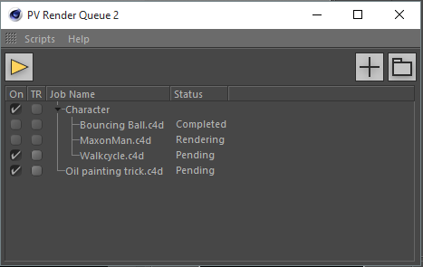
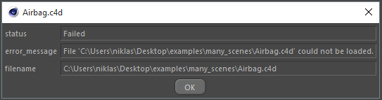
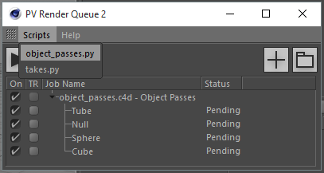

# PV Render Queue

PV Render Queue is a free Cinema 4D Plugin by [Niklas Rosenstein] that allows
you to queue render jobs and render them directly in the Picture Viewer using
the external or Team Render.

  [Niklas Rosenstein]: https://niklasrosenstein.com/

Watch a Preview Video on Vimeo.com:

  <iframe src="https://player.vimeo.com/video/135858013" width="500" height="273" frameborder="0" webkitallowfullscreen mozallowfullscreen allowfullscreen></iframe>
  
<a href="https://vimeo.com/135858013">PV Render Queue 2</a> from <a href="https://vimeo.com/niklasrosenstein">Niklas Rosenstein</a> on <a href="https://vimeo.com">Vimeo</a>.

## Features

- Supports **all** render engines
- View the render progress right in the Picture Viewer
- Add single files or all from a folder
- Job Folders
- Team Render support
- Python Scripting API
- Render Object-Buffers quickly and easily (see video 5:56)
- Takes Support (R17) (see video 4:08)

## Documentation

### Adding a Job

On the top-right corner of the PV Render Queue 2 window, you can find a ``+``
and a "folder" button. With the ``+`` button, you can select a single Cinema 4D
scene file. You can add all Cinema 4D scene files in one folder by using the
"folder" button.

### Starting the Queue

By pressing the "play" button, the plugin will start new render jobs whenever
the Picture Viewer is not rendering. You can disable the render queue by
pressing the button again (which has turned into a "pause" icon). If a
rendering is taking place while the queue is disabled, you will be asked
whether the current rendering should be cancelled. You may press "No" to let
the render continue but still disable the render queue.

### View Job Details

You can view details about a job by double-clicking or choosing the
"Job Details..." entry from the right-click context menu. If an error occurred
while processing the job, you will find an error message in this dialog.

### Scripts

The PV RenderQueue plugin provides a Python Scripting API that allows you to
write custom render jobs. Two useful scripts are included. You can add your
own scripts by placing the into the plugins `scripts/` folder. You can also
just run them from the Cinema 4D Script Manager!

#### queue_current_project

*Added in v2.2* This script adds the current project to the render queue.

#### takes

*Requires Cinema 4D R17+*. With this script, you can create a render job for
each take that you selected in the Takes Manager.

#### object_passes (Object Buffers)

With this script, you can create a render job for each object selected in the
Objects Manager. The scene will be modified internally so that it renders
completely black, except for the selected object. The script will also disable
many unnecessary options to speed up the rendering.

!!!note "Incompatibility"
    Due to a Cinema 4D bug introduced in R17.053 which is only fixed
    in R18.039 and newer, the *"takes"* script does not function!
